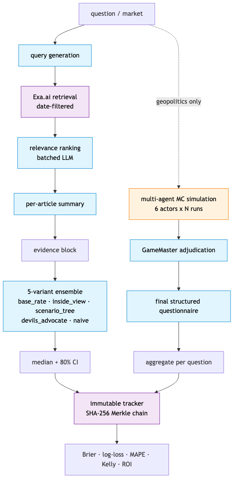
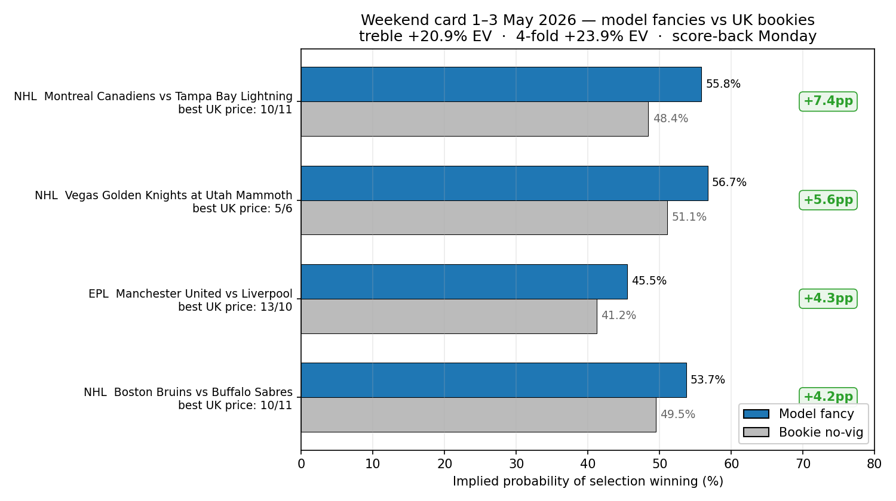
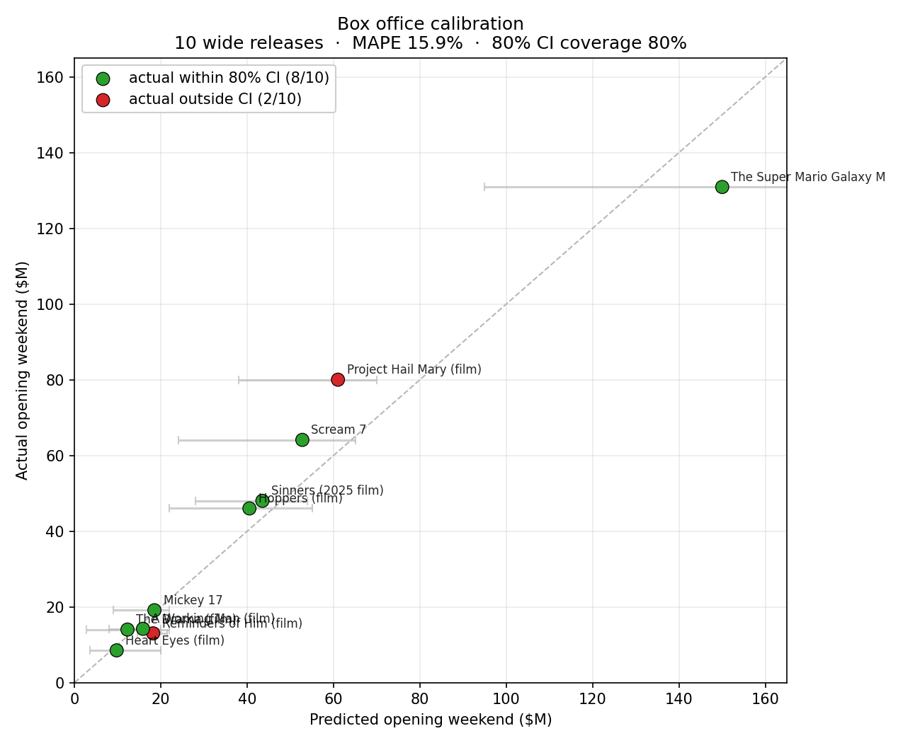

# WorldClone

> An LLM forecasting toolkit. Halawi-style retrieval, multi-agent Monte Carlo
> simulation, and Kelly-aware accumulator analysis — pointed at geopolitics,
> box office, and sports. 100% local on an M5 Mac (Qwen 3.6 27B via LM Studio).



## What's in here

| Domain | Method | Headline result |
|---|---|---|
| Geopolitics (Iran 2026, 6 questions) | Halawi forecaster vs multi-agent MC sim vs Manifold crowd | crowd Brier **0.001**, sim **0.131**, forecaster **0.272** (worse than naive 50%) |
| Box office (10 wide releases, 2025–2026) | 5-variant ensemble + Monte Carlo first-week | **MAPE 15.9%**, 80% within ±20%, 100% within ±50%, naive baseline 101% |
| Sports (NBA + NHL + EPL playoffs) | 5-variant ensemble + Kelly accumulator | NBA picks **4 / 7** to date; weekend May 1–3 parlays at +21–24% theoretical EV |

The Iran simulation cleared naive 50% (Brier 0.131). The LLM forecaster
did not (Brier 0.272). Neither came close to the late Manifold crowd. That
is the actual result and it is in the repo for anyone to verify.

## This weekend's card — 1–3 May 2026

Selections logged before kick-off in
[`results/sports_forecasts/weekend_2026_05_01/REPORT.md`](results/sports_forecasts/weekend_2026_05_01/REPORT.md).
Prices below are best UK high-street (Bet365 / Sky Bet / Ladbrokes / Coral
agree within a tick or two on these).

| Selection | Market | Best price | Decimal | Model fancy | Bookie no-vig | Edge |
|---|---|---|---|---|---|---|
| **Montreal Canadiens** to win Game 6 vs Tampa Bay | NHL Match Result | **10/11** | 1.95 | 55.8% | 48.4% | **+7.4 pp** |
| **Vegas Golden Knights** to win Game 6 at Utah | NHL Match Result | **5/6** | 1.87 | 56.7% | 51.1% | **+5.6 pp** |
| **Manchester United** to beat Liverpool | EPL 1X2 | **13/10** | 2.30 | 45.5% | 41.2% | **+4.3 pp** |
| **Boston Bruins** to beat Buffalo Game 6 | NHL Match Result | **10/11** | 1.91 | 53.7% | 49.5% | +4.2 pp |

**Treble** (Canadiens + Golden Knights + Man Utd) priced at **8.40**
(roughly 7/1) — theoretical EV **+20.9%**.
**4-fold** (above + Bruins) priced at **16.03** (roughly 15/1) —
theoretical EV **+23.9%**.

**This is not betting advice.** It is an immutable record of what the
toolkit produced before kick-off. Score-back goes up Monday 4 May —
win or lose. 

## Quickstart

Prerequisites: Python 3.11+, [uv](https://github.com/astral-sh/uv), and
[LM Studio](https://lmstudio.ai) running locally with `qwen/qwen3.6-27b`
loaded (parallel=2). [Exa.ai](https://exa.ai) API key for news retrieval
(only required when generating fresh forecasts; the included results are
already cached).

```bash
git clone https://github.com/jhammant/worldclone.git
cd worldclone
uv sync --extra dev
cp .env.example .env  # add EXA_API_KEY if you plan to fetch fresh news
uv run pytest tests/  # 58 unit tests, no LLM calls, ~2s
```

## Architecture

Both pipelines share the same retrieval + ensemble core. The simulation
adds a multi-agent Monte Carlo branch on top.

```
question / market
        │
        ▼
  query generation ────►  Exa.ai (date-filtered)
        │                       │
        │                       ▼
        │                 relevance ranking (LLM, batched)
        │                       │
        │                       ▼
        │                 per-article summary
        │                       │
        ▼                       ▼
  evidence block ◄──────────────┘
        │
        ▼
  5-variant ensemble  ─►  median + 80% CI
        │
        │       (geopolitics only)
        │       multi-agent MC sim
        │       6 actors × N runs
        │       │
        ▼       ▼
   immutable tracker (SHA-256 Merkle chain)
        │
        ▼
   Brier / log-loss / MAPE / Kelly
```

The 5 ensemble variants live in `worldclone/forecaster/prompts.py`:
`base_rate`, `inside_view`, `scenario_tree`, `devils_advocate`, `naive`.
Box office adds a 6th (`leading_indicators`) for previews/presales/trailer
views. Each variant runs at temperature 0.7. Aggregation: median for the
point estimate; min-low / max-high for the ensemble CI to widen by
disagreement.

## Domains in detail

### Geopolitics — Iran cluster

Six post-resolution Manifold questions about Iran in early 2026. Two
methods compete:

- **Halawi-style forecaster** (`worldclone/forecaster/`): query gen →
  Exa retrieval (`endPublishedDate=2026-03-28`) → relevance rank → summarise
  → ensemble. Single-question pipeline, run independently for each market.
- **Multi-agent simulation** (`worldclone/simulation/`): six agents
  (Trump, Mojtaba Khamenei, IRGC, Netanyahu, Putin, Pakistan) act in
  rounds; a GameMaster adjudicates and updates a small world-state dict;
  a final-step structured questionnaire extracts all 6 outcomes from each
  run. 15 runs.

Final scores ([`results/iran_pilot/overnight_20260427_2305Z/`](results/iran_pilot/overnight_20260427_2305Z/)):

| Method | Mean Brier | 95% CI | Mean log-loss |
|---|---|---|---|
| community_close (Manifold late prices) | 0.0010 | [0.0003, 0.0021] | 0.027 |
| community_time_avg (Manifold lifetime average) | 0.1061 | [0.0499, 0.1599] | 0.363 |
| simulation (multi-agent MC) | **0.1311** | [0.0363, 0.2259] | 0.359 |
| naive_50 (always 50%) | 0.2500 | [0.2500, 0.2500] | 0.693 |
| forecaster (Halawi-style) | **0.2723** | [0.0868, 0.4578] | 0.713 |

Run it yourself:

```bash
# One-time Exa fetch (~$5)
uv run python scripts/run_forecaster_iran.py --fetch-only

# Forecaster (~35–45 min local)
uv run python scripts/run_forecaster_iran.py

# Simulation (~6–7 hr local, run overnight)
uv run python scripts/run_simulation_iran.py

# Score
uv run python scripts/score_iran.py
```

### Box office — opening-weekend forecaster

10 wide releases from 2025–early 2026, ground truth landed.
([`results/film_forecasts/big_clean_20260429_1312Z/`](results/film_forecasts/big_clean_20260429_1312Z/))

| Metric | Value |
|---|---|
| MAPE | **15.9%** |
| Median APE | 13.5% |
| 80% CI coverage (target 80%) | 80% — calibrated |
| % within ±20% of actual | 80% |
| % within ±50% of actual | 100% |
| Naive baseline (median-predict-all) | 101.1% |



Same retrieval + ensemble as the forecaster, with two additions: a
sharp "leading indicators" prompt variant that weights Thursday previews
/ presales / trailer views; and a Monte Carlo first-week extrapolator
that bootstraps day-of-week curves around the ensemble's opening point.

```bash
# Add films to data/films/candidates.json (or seed from Wikipedia):
uv run python scripts/build_film_candidates.py --from-wikipedia 2026

# Forecast (~80s/film at parallel=2)
uv run python scripts/run_film_forecaster.py

# After Sunday close, fill actual_opening_weekend_usd, then score:
uv run python scripts/score_films.py --run-dir results/film_forecasts/{run_id}
```

### Sports — game forecaster + Kelly accumulator

Same 5-variant ensemble (`form_and_stats`, `vegas_anchored`,
`playoff_dynamics`, `devils_advocate`, `naive`) on per-game win
probability. Outputs feed into a Kelly-criterion accumulator analyzer
that picks legs with edge ≥ 2 pp and prices 3/4/5-leg parlays.

NBA picks to date: **4 / 7** hit rate (Knicks G4, Thunder G4, Rockets G5;
Avalanche, Arsenal-Atlético [draw, market mis-modelled], two pushes).
EPL games carry a `vegas_draw_moneyline` field so the accumulator
respects 3-way pricing — the prior week's miss on the Atlético-Arsenal
draw was the lesson that drove that fix.

Weekend May 1–3 picks are above and in
[`results/sports_forecasts/weekend_2026_05_01/REPORT.md`](results/sports_forecasts/weekend_2026_05_01/REPORT.md).

```bash
uv run python scripts/run_sports_forecaster.py \
  --games data/sports/weekend_2026_05_01.json --as-of-date 2026-05-01
uv run python scripts/accumulator_analysis.py \
  --forecasts results/sports_forecasts/{run_id}/forecasts.jsonl \
  --games data/sports/weekend_2026_05_01.json \
  --bankroll 100 --kelly-fraction 0.25 --min-edge-pp 2.0 \
  --out-md results/sports_forecasts/{run_id}/REPORT.md
```

## Immutable tracker

`worldclone/tracker/store.py` provides an append-only JSONL log where
each prediction is hashed (SHA-256 over the prediction's content + the
previous line's hash). The chain is git-committable: a retroactive edit
to line N would force-rewrite every subsequent line, which would show up
as a verification failure and a noisy diff.

Two operations:
- `append_prediction(...)` — write a new prediction, computing the hash
- `verify_chain(tracker_path)` — walk the file and confirm every link
  resolves

The point: the public picks above were committed with the hash chain
intact. If they're wrong on Monday, you'll see it. If they're right, you
can verify they were the original picks.

## Stack

| Layer | Choice |
|---|---|
| Inference | Qwen 3.6 27B local via LM Studio, parallel=2, M5 Mac 128 GB |
| LLM wrapper | LiteLLM with concurrency semaphore + JSON-schema mode + 4-attempt retry |
| Schemas | Pydantic v2 |
| News retrieval | Exa.ai with `endPublishedDate` cutoff + post-filter for dateless leaks |
| Concurrency | asyncio with parallel=2 (LM Studio plateaus past 2 on this hw) |
| Tests | pytest, no LLM calls (smoke tests run on CI) |
| Build | uv |

~3,500 lines of Python.

## Honest caveats

- **N is tiny across all domains.** 6 questions, 10 films, 7 NBA games.
  Any of these results could flip on the next batch.
- **Training-data contamination is real.** Mitigations in code:
  date-filtered Exa retrieval, post-filter for articles with no
  `published_date`, regex scrubber on `notes` fields to redact dollar
  amounts and "ACTUAL" leak phrases, post-cutoff `as_of_date` on every
  query. None of this is bulletproof. The Iran cutoff is 2026-03-28
  (post-Khamenei-assassination, pre-resolution).
- **The Iran LLM forecaster did worse than naive 50%.** That is reported
  here in plain numbers, not buried.
- **Sportsbook accumulator vig compounds.** The "+21% EV" parlay number
  assumes book-fair joint pricing; a real sportsbook would mark the
  parlay worse than the implied joint of singles. Treat the EV as an
  upper bound.
- **Independence assumption is wrong.** Real-world legs correlate
  (shared news cycle, weather, broadcast slot). Joint probabilities from
  multiplying singles are over-confident.
- **This is not betting advice.** The accumulator analysis is a
  thinking exercise and an immutable record, not a strategy.

## Tests

```bash
uv run pytest tests/  # 4 suites, ~2 seconds, no external calls
```

GitHub Actions runs the same tests on every push.

## Repo map

```
worldclone/
  common/         # LLM wrapper, Manifold loader, Pydantic schemas
  forecaster/     # Halawi-style retrieval + ensemble pipeline
  simulation/     # Multi-agent Monte Carlo loop
  boxoffice/      # Film-specific pipeline + Monte Carlo first-week
  sports/         # Sport-specific pipeline + game schemas
  scoring/        # Brier, MAPE, Kelly, Vegas-edge ROI
  tracker/        # Append-only Merkle-chained prediction log
scripts/          # CLI entry points (run_*, score_*, plot_*)
tests/            # pytest, no LLM
data/             # Hand-curated source files (Iran cluster, films, games)
results/          # Public evidence trail (Iran pilot + film batch + weekend picks)
docs/             # Architecture diagram + result images
```

## License

MIT — see [LICENSE](LICENSE).
