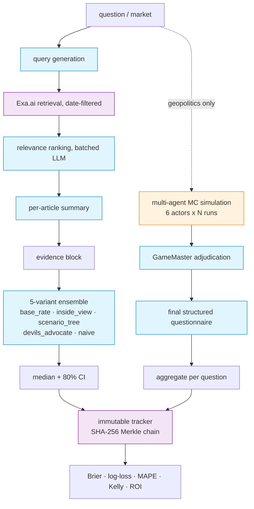

# Architecture

Both pipelines share the same retrieval + ensemble core. The simulation
adds a multi-agent Monte Carlo branch on top.

## Pipelines

### Halawi-style forecaster (`worldclone/forecaster/`)

Single-question pipeline. Used for prediction-market questions and
extended for box-office and sports forecasting.

1. **Query generation** — LLM expands the market question into 4 search
   queries.
2. **Exa retrieval** — fan-out search with `endPublishedDate` set to the
   forecast cutoff. Defensive post-filter drops articles with empty
   `published_date` (Exa's filter doesn't catch evergreen / undated
   pages).
3. **Relevance ranking** — single batched LLM call scores all retrieved
   articles 0–10 against the question. Top 12 kept.
4. **Summarisation** — parallel summaries (one LLM call per kept
   article), each ~150 tokens.
5. **Ensemble** — 5 prompt variants run at temperature 0.7 (3 batches of
   2 to respect parallel=2). Aggregation: median for the point estimate,
   min-low / max-high for CI to widen by ensemble disagreement.

### Multi-agent simulation (`worldclone/simulation/`)

Monte Carlo over actor decisions. Used for the Iran cluster.

- **Actors** (`actors.py`) — 6 hand-curated agent configs (Trump,
  Mojtaba Khamenei, IRGC, Netanyahu, Putin, Pakistan), each with a
  role, public position, private goals, known/hidden facts.
- **Loop** (`loop.py`) — for each MC run: at each step, every actor
  proposes an action conditioned on its slice of the world state; the
  GameMaster adjudicates the round and emits a state delta + narrated
  event.
- **GameMaster** (`gm.py`) — JSON-schema-constrained LLM with strict
  output. World state is a small dict (casualties_us, casualties_iran,
  ground_troops_in_iran, infrastructure_struck, nuclear_used,
  ceasefire_in_effect, aircraft_lost).
- **Questionnaire** (`questionnaire.py`) — at the final step, one
  structured-output LLM call answers all 6 cluster questions yes/no
  per run.
- **Extract** (`extract.py`) — aggregate N runs into per-question
  probability with Wilson 95% CI.

Iran pilot used N=15 runs × 12 steps. Resume support via per-run
checkpoints so a crashed overnight run picks up at the next un-completed
run.

### Immutable tracker (`worldclone/tracker/store.py`)

Append-only JSONL. Each record's `prediction_hash` is `SHA-256(prev_hash
|| stable_json_dump(payload))`. Resolution updates rewrite the record
fields but explicitly do NOT recompute the hash — the original
prediction's hash chain remains valid.

`verify_chain()` walks the file and reports any line where:
- `prev_hash` ≠ the previous record's `prediction_hash`
- recomputed hash ≠ stored `prediction_hash`

## Stack

- **Inference**: Qwen 3.6 27B local via LM Studio, parallel=2, M5 Mac 128 GB.
- **Wrapper** (`worldclone/common/llm.py`): LiteLLM-compatible client
  with concurrency semaphore, JSON-schema output, 4-attempt
  exponential-backoff retry on 5xx/429, runtime kill-switch.
- **Retrieval**: Exa.ai with `endPublishedDate`, on-disk cache keyed
  by `(query, before_date)`.
- **Schemas**: Pydantic v2.
- **Async**: asyncio, batched to respect parallel=2 (LM Studio plateaus
  past 2 on this hardware).
